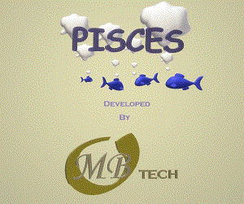

### Welcome to MOBTech's PISCES project
This page is set up as a test repository for the project

### Authors and Contributors
Created by @Neodreadlord

In order to run Pisces, you will have to have Python 3.7.5 or greater installed.
Download [Here](https://www.python.org/downloads/release/python-375/)

DOWNLOADS:

Download the first complete version of PISCES
[Pisces Setup version 1.0](https://github.com/Neodreadlord/pisces/raw/master/Setup.exe)

updated files for PISCES application
[Sql Scan](sqli_scan.py)
[Xss Scan](xss_scan.py)
[Port Scan](port_scan.py)
[Cipher Scan](cipher_scan.py)
[Updated Text File](updated.txt)
[Updated Instruction File](instructions.txt)

